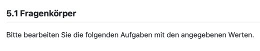
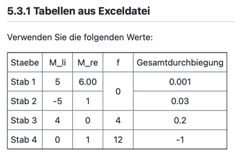
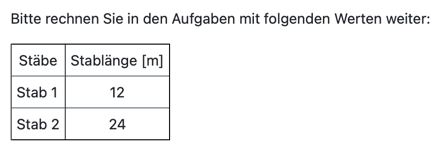
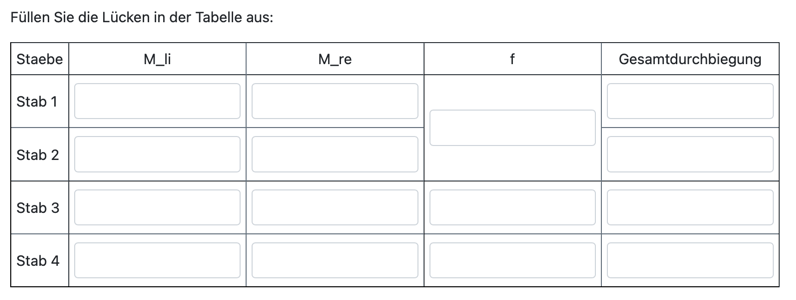
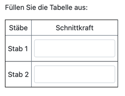
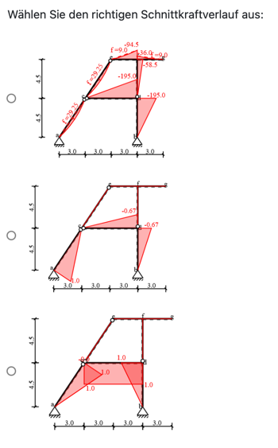
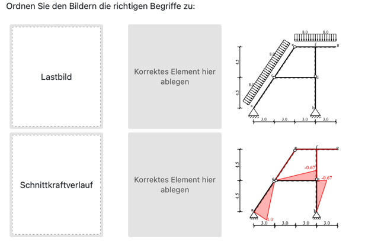
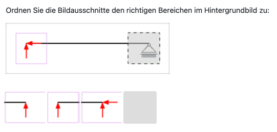

# Inhalt

Diese README dient als Handbuch für den allgemeinen Workflow mit dem Programm und erklärt dabei die wichtigsten Bausteine.

In diesem Ordner befinden sich weiterhin einige Beispielskripte zur script-basierten Testerstellung mit `TestFacade`. Sie enthalten vollständige Beispieltests, die ausgeführt und anschließend in OPAL hochgeladen werden können, um die beschriebenen Funktionen besser zu verstehen.

Der grundlegende Ablauf beim Arbeiten mit dem Programm entspricht der Reihenfolge im folgenden Inhaltsverzeichnis.

---
## Inhaltsverzeichnis

[1 Test erstellen oder laden](#1-test-erstellen-oder-laden)\
[2 Bilder und Excel-Dateien einbinden](#2-bilder-und-excel-dateien-einbinden)\
[3 Variantenvergabe einrichten](#3-variantenvergabe-einrichten)\
[4 Teststruktur erstellen](#4-teststruktur-erstellen)\
[5 Sektionen bearbeiten](#5-sektionen-bearbeiten)\
[6 Aufgaben bearbeiten](#6-aufgaben-bearbeiten)\
[7 Globale Einstellungen tätigen](#7-globale-einstellungen-tätigen)\
[8 Test exportieren](#8-test-exportieren)\
[9 Beispielskripte](#9-beispielskripte)
---

# 1 Test erstellen oder laden
## 1.1 Neuen Test erstellen

```python
from backend.facades import TestFacade

test = TestFacade("Mein Test")
```

Diese Variante wird verwendet, wenn ein komplett neuer Test erzeugt werden soll.

---
## 1.2 Bestehenden Test laden

```python
from backend.facades import TestFacade

test = TestFacade().load_test("pfad/zum/test.json")
```

Diese Variante wird verwendet, wenn ein bereits erzeugter Test weiterbearbeitet werden soll.

---

# 2 Bilder und Excel-Dateien einbinden

## 2.1 Bilder laden

```python
images = test.load_images("files/media").map()
```

Durch `.map()` können Bilder über ihren Dateinamen angesprochen werden:

```python
images["bild.png"]
```

Beispiel:

```python
task.item_body(
    "Betrachten Sie das folgende Bild:\n" +
    images["bild.png"]
)
```

Bilder können nachträglich in ihrer Größe angepasst werden.
Beispiel: Breite aller Bilder setzen. Das Verhältnis aus Breite / Höhe bleibt dabei erhalten

```python
for key, image in images.items():
    image.set_width("400")
```

---
## 2.2 Excel-Datei verwenden

```python
excel_file = "files/Beispiel.xlsx"
```

Die Excel-Datei kann später für Antwortfelder, Tabellen oder Varianten verwendet werden.

---

# 3 Variantenvergabe einrichten

Varianten werden über `test.variants()` aktiviert.

Varianten werden verwendet, um mehreren Lernenden unterschiedliche Werte, Bilder, Tabellen oder Aufgabeninhalte zuzuweisen. Dadurch können aus demselben Testskript verschiedene Testversionen erzeugt werden, ohne für jede Version einen eigenen Test schreiben zu müssen.

```python
variants = test.variants("student_id_to_variant_assignment")
```

Je nach gewünschtem Verhalten kann die Variantenvergabe unterschiedlich eingerichtet werden.

---
## 3.1 Manuelle Variantenvergabe

Bei dieser Variante legt der Ersteller des Tests fest, wie viele Varianten es insgesamt geben soll:

```python
variants = test.variants("manual_assignment")
variants.assignment.count_variants = 150
variants.item_body = "Geben Sie ihre Variante ein: {RESPONSE}"
```

Damit arbeitet der Test mit `150` möglichen Varianten.

Die eigentliche Zuweisung der Variante erfolgt dabei **nicht automatisch im Test**. Stattdessen weist der Lehrende den Studierenden vorab eine Variante zu. Die Studierenden geben diese zugewiesene Variante anschließend selbst im Test ein.

Wichtig ist: Der Test kann dabei nicht überprüfen, ob ein Studierender tatsächlich die richtige zugewiesene Variante eingibt. Diese Art der Variantenvergabe eignet sich daher vor allem, wenn die exakte Kontrolle der Variantenzuweisung nicht entscheidend ist.

Typischer Einsatz:

- der OPAL-Test dient eher zur Überprüfung oder Eingabe von Ergebnissen
- Varianten werden außerhalb des Tests durch den Lehrenden vergeben
- eine automatische Überprüfung der korrekten Variantenzuordnung ist nicht erforderlich
---

## 3.2 Variantenvergabe über Matrikelnummer

```python
variants = test.variants("student_id_to_variant_assignment")
variants.assignment.count_variants = 150
variants.item_body = "Geben Sie Ihre Matrikelnummer ein: {RESPONSE}"
```

Bei dieser Variante legt der Ersteller des Tests zunächst fest, wie viele Varianten es insgesamt geben soll:

```python
variants.assignment.count_variants = 150
```

Die Studierenden geben im Test ihre Matrikelnummer ein. Aus dieser Matrikelnummer wird automatisch eine Variante bestimmt. Die Zuweisung muss daher nicht vorher manuell durch den Lehrenden erfolgen.

Für die Zuordnung wird ein Algorithmus verwendet, der versucht, die Matrikelnummern möglichst gleichmäßig auf alle verfügbaren Varianten zu verteilen. Dabei kann jedoch nicht garantiert werden, dass jede Variante exakt gleich häufig vergeben wird.

`{RESPONSE}` wird im Aufgabentext durch ein Eingabefeld ersetzt:

```python
variants.item_body = "Geben Sie Ihre Matrikelnummer ein: {RESPONSE}"
```

Der wesentliche Vorteil dieser Methode ist, dass die Matrikelnummer in OPAL automatisch überprüft wird. Dadurch kann sichergestellt werden, dass Studierende mit der für sie berechneten Variante arbeiten.

Diese Art der Variantenvergabe eignet sich besonders, wenn die korrekte Variantenzuweisung wichtig ist, zum Beispiel bei Prüfungsvorleistungen.

Typischer Einsatz:

- die Variante soll automatisch aus der Matrikelnummer bestimmt werden
- die Matrikelnummer soll in OPAL automatisch überprüft werden
- Studierende sollen mit der korrekten Variante arbeiten

---
## 3.3 Variantenvergabe über Variablen

```python
variants = test.variants("variable_dependent_assignment")
```

Diese Art der Variantenvergabe wird verwendet, wenn der Lehrende selbst festlegen möchte, wie bestimmte Matrikelnummern auf Varianten oder Variablen abgebildet werden. Die Variante wird dabei aus bestimmten Ziffern der Matrikelnummer bestimmt.

Das ist besonders praktisch bei einer kleineren Anzahl von Varianten oder wenn der Lehrende selbst kontrollieren möchte, welche Variante wie oft vergeben wird. Im Gegensatz zur automatischen Variantenvergabe über Matrikelnummer erfolgt die Zuordnung hier nicht über einen allgemeinen Verteilungsalgorithmus, sondern über selbst definierte Regeln.

Wie bei der automatischen Variantenvergabe über Matrikelnummer besteht auch hier der Vorteil, dass OPAL die eingegebene Matrikelnummer überprüfen kann. Dadurch kann sichergestellt werden, dass Studierende mit den für sie vorgesehenen Werten oder Varianten arbeiten.

Beispiel:

```python
data = {
    "a": [{0: [0, 3]}, {1: [4, 7]}, {2: [8, 9]}],
    "b": [{5: [0, 2]}, {5.5: [3, 5]}, {6: [6, 9]}]
}

for i, (key, ranges) in enumerate(data.items()):
    variable = variants.assignment.add_variable()
    variable.value_response = i + 1
    variable.add_variable(key)

    for d in ranges:
        cond_value, (lo, hi) = next(iter(d.items()))

        condition = variable.add_condition()
        condition.lower_bound = lo
        condition.upper_bound = hi
        condition.values = {key: cond_value}
```

In diesem Beispiel werden die Variablen `a` und `b` abhängig von bestimmten Ziffern der eingegebenen Matrikelnummer gesetzt.

Beispielhafte Bedeutung:

| Variable | Bedingung | Wert |
|---|---|---|
| `a` | Ziffer liegt zwischen `0` und `3` | `0` |
| `a` | Ziffer liegt zwischen `4` und `7` | `1` |
| `a` | Ziffer liegt zwischen `8` und `9` | `2` |
| `b` | Ziffer liegt zwischen `0` und `2` | `5` |
| `b` | Ziffer liegt zwischen `3` und `5` | `5.5` |
| `b` | Ziffer liegt zwischen `6` und `9` | `6` |

Dabei legt `variable.value_response` fest, welche Ziffer der eingegebenen Matrikelnummer für die jeweilige Variable verwendet wird:

```python
variable.value_response = i + 1
```

Die Bedingungen definieren anschließend, welcher Wert gesetzt wird, wenn diese Ziffer in einem bestimmten Bereich liegt:

```python
condition.lower_bound = lo
condition.upper_bound = hi
condition.values = {key: cond_value}
```

Typischer Einsatz:

- kleinere Anzahl von Varianten
- der Lehrende möchte steuern, welche Variante wie häufig vergeben wird
- OPAL soll die eingegebene Matrikelnummer überprüfen können
- konkrete Werte wie `a`, `b`, `F`, `l` usw. sollen abhängig von der Matrikelnummer gesetzt werden

# 4. Teststruktur erstellen

Ein Test ist hierarchisch aufgebaut. Er kann aus mehreren Sektionen bestehen, und jede Sektion kann wiederum mehrere Aufgaben enthalten.

Die Grundstruktur sieht so aus:

```text
Test
├── Sektion 1
│   ├── Aufgabe 1 1
│   ├── Aufgabe 1 2 
│   └── Aufgabe 1 3
└── Sektion 2
    ├── Aufgabe 2 1
    └── Aufgabe 2 2
```

Der zugehörige Python-Code sieht so aus:

```python
# Sektion 1 erstellen
section_1 = test.add_section("Sektion 1")

# Aufgaben in Sektion 1 erstellen
task_1_1 = section_1.add_task("Aufgabe 1 1")
task_1_2 = section_1.add_task("Aufgabe 1 2")
task_1_3 = section_1.add_task("Aufgabe 1 3")

# Sektion 2 erstellen
section_2 = test.add_section("Sektion 2")

# Aufgaben in Sektion 2 erstellen
task_2_1 = section_2.add_task("Aufgabe 2 1")
task_2_2 = section_2.add_task("Aufgabe 2 2")
```
Die dabei definierten Variablen wie `section_1`, `task_1_1` oder `task_2_1` werden später verwendet, um die jeweiligen Sektionen und Aufgaben weiter zu bearbeiten.

---

# 5 Sektionen bearbeiten
## 5.1 Fragenkörper

Der sichtbare Text (Fragenkörper) einer Sektion wird mit `item_body()` definiert. Dieser Text erscheint später im Test oberhalb der Aufgaben dieser Sektion.


In den Fragenkörper können normaler Text und zuvor definierte Sektionsinhalte eingefügt werden. Dazu gehören:

- [Variablen](#52-excel-variablen)
- [Tabellen](#53-tabellen)
- [Bilder](#21-bilder-laden)

Ein einfaches Beispiel:

```python
section.item_body(
    "Bitte bearbeiten Sie die folgenden Aufgaben mit den angegebenen Werten."
)
```

  
*Screenshot aus OPAL*

---
## 5.2 Excel-Variablen

Excel-Variablen werden verwendet, wenn gegebene Werte abhängig von der zugewiesenen Variante aus einer Excel-Datei gelesen werden sollen. Diese Werte können anschließend im Section-Text oder in Tabellen angezeigt werden.

Zuerst wird für die Sektion ein Excel-Variablen-Objekt erzeugt:

```python
ev = section.add_excel_variables()
```

Danach werden Excel-Datei und Tabellenblatt festgelegt:

```python
ev.excel_file = excel_file
ev.page = "Varianten"
```

Dabei enthält `excel_file` den Pfad zur [Excel-Datei](#2-bilder-und-excel-dateien-einbinden).


Anschließend werden die Startzellen der Variablen angegeben. Jede Variable liest ihre Werte horizontal aus der Excel-Datei. Die angegebene Zelle enthält dabei den Wert für Variante 1, die Zelle rechts daneben den Wert für Variante 2 und so weiter.

Beispiel:

```python
for i in range(0, 5):
    ev.add_variable("C" + str(10 + i))
```

Damit werden fünf Excel-Variablen erzeugt:

| Variable | Startzelle | Bedeutung |
|---|---|---|
| `ev.variables[0]` | `C10` | Werte aus `C10`, `D10`, `E10`, ... |
| `ev.variables[1]` | `C11` | Werte aus `C11`, `D11`, `E11`, ... |
| `ev.variables[2]` | `C12` | Werte aus `C12`, `D12`, `E12`, ... |
| `ev.variables[3]` | `C13` | Werte aus `C13`, `D13`, `E13`, ... |
| `ev.variables[4]` | `C14` | Werte aus `C14`, `D14`, `E14`, ... |

Die erzeugten Variablen können direkt im [Fragenkörper](#51-fragenkörper) verwendet werden:

```python
section.item_body(
    "Gegebene Kraft: $$F =$$ " + ev.variables[-1] + " kN"
)
```
---
## 5.3 Tabellen
In Sektionen dienen Tabellen zur Anzeige von Informationen.
Es stehen zwei verscheidene Arten von Tabellen zur Verfügung:

1. Tabellen aus einer Excel-Datei
2. benutzerdefinierte Tabellen, die direkt im Python-Code aufgebaut werden

Tabellen werden zunächst erstellt und anschließend im [Fragenkörper](#51-fragenkörper) der Sektion mit `item_body()` eingefügt.

---

### 5.3.1 Tabellen aus Exceldatei

Eine Tabelle kann direkt aus einem Bereich einer Excel-Datei erzeugt werden. Das ist besonders praktisch, wenn gegebene Werte oder vorbereitete Tabellen bereits in Excel vorliegen.

Zuerst wird eine Tabelle vom Typ `"excelTable"` erstellt:

```python
table = section.table("excelTable")
```

Danach werden die Excel-Datei und das Arbeitsblatt festgelegt:

```python
table.excel_file = excel_file
table.page = "Tabelle"
```

Dabei enthält `excel_file` den Pfad zur [Excel-Datei](#2-bilder-und-excel-dateien-einbinden).

Der gewünschte Tabellenbereich wird mit `add_area()` angegeben:

```python
area = table.add_area("C4", "H8")
```

Dabei ist `"C4"` die linke obere Zelle und `"H8"` die rechte untere Zelle des verwendeten Bereichs.

Die erzeugte Tabellenfläche wird anschließend in den [Fragenkörper](#51-fragenkörper) der Sektion eingefügt:

```python
section.item_body(
    "Verwenden Sie die folgenden Werte:\n" +
    area
)
```

  
*Screenshot aus OPAL*

---

### 5.3.2 Benutzerdefinierte Tabellen

Benutzerdefinierte Tabellen werden direkt im Python-Code aufgebaut. Diese Variante eignet sich, wenn die Tabelle nicht aus einem zusammenhängenden Excel-Bereich übernommen werden soll oder wenn die Inhalte flexibel aus zuvor erzeugten Elementen zusammengesetzt werden sollen.

Dazu wird eine Tabelle vom Typ `"customTable"` erstellt:

```python
table = section.table("customTable")
```

Die Tabellenzellen werden anschließend mit `Cell` definiert. Dafür muss `Cell` importiert werden:

```python
from backend.utils import Cell
```

Eine einfache Tabelle kann so erstellt werden:

```python
from backend.utils import Cell

table = section.table("customTable")

table.cells.append([Cell("Stäbe"), Cell("Stablänge [m]")])
table.cells.append([Cell("Stab 1"), Cell("12")])
table.cells.append([Cell("Stab 2"), Cell("24")])
```

Jeder Eintrag in `table.cells` entspricht einer Tabellenzeile. Eine Tabellenzeile besteht aus mehreren `Cell`-Objekten.

Ein `Cell`-Objekt kann verschiedene Inhalte erhalten. Dazu gehören normaler Text, [Excel-Variablen](#52-excel-variablen) oder Formatierungshilfen.

Beispiele:

```python
Cell("Stab 1")                     # normaler Text
Cell(ev.variables[0])              # Excel-Variable aus der Sektion
Cell(">>")                        # verbindet die Zelle mit der Zelle links daneben
Cell("vv")                        # verbindet die Zelle mit der Zelle darüber
```

Im Beispielskript wird die Tabelle mit einer Schleife erzeugt:

```python
from backend.utils import Cell

table = section.table("customTable")

for i in range(0, len(ev.variables)):
    if i == 0:
        table.cells.append([Cell("Stäbe"), Cell("Stablänge [m]")])
    else:
        table.cells.append([
            Cell("Stab " + str(i)),
            Cell(ev.variables[i - 1])
        ])
```

Dadurch wird zuerst eine Kopfzeile erstellt. Danach wird für jede Excel-Variable aus `ev.variables` eine weitere Tabellenzeile angelegt.

Die erzeugte Tabelle wird anschließend in den [Fragenkörper](#51-fragenkörper) der Sektion eingefügt:

```python
section.item_body(
    "Bitte rechnen Sie in den Aufgaben mit folgenden Werten weiter:\n" +
    table
)
```

  
*Screenshot aus OPAL*

---
# 6 Aufgaben bearbeiten

## 6.1 Fragenkörper

Der Fragenkörper wird mit `item_body()` definiert. Er beschreibt den Inhalt, den der Studierende später in der Aufgabe sieht.

In den Fragenkörper können normaler Text und zuvor definierte Aufgabeninhalte eingefügt werden. Dazu gehören:

- [Antworten](#62-antworten)
- [Tabellen](#63-tabellen)
- [Auswahlaufgaben](#64-auswahlaufgaben)
- [Zuordnungsaufgaben](#65-zuordnungsaufgaben)
- [variantenabhängige Inhalte](#66-variantenabhängiger-inhalt)
- [Bilder](#2-bilder-und-excel-dateien-einbinden)

Ein einfaches Beispiel:

```python
response = task.response(5)

task.item_body(
    "Betrachten Sie das folgende Bild:\n" +
    images["lastbild.png"] + "\n"
                             
    "Berechnen Sie den gesuchten Wert:\n" +
    "Antwort: " + response
)
```

Der Fragenkörper ist damit der zentrale Bereich, in dem alle sichtbaren Bestandteile einer Aufgabe zusammengesetzt werden.

  
*Screenshot aus OPAL*

---
## 6.2 Antworten

Antworten sind Eingabefelder, die später im Fragenkörper der Aufgabe verwendet werden können. Der Studierende sieht an dieser Stelle ein Feld, in das er seine Antwort einträgt.

Es gibt zwei typische Möglichkeiten, Antwortfelder zu erstellen:

1. normale Antworten mit einem direkt angegebenen richtigen Wert
2. Antworten, deren richtige Werte aus einer Excel-Datei gelesen werden

Antworten werden zunächst erstellt und anschließend im [Fragenkörper](#61-fragenkörper) mit `item_body()` eingefügt.

---

### 6.2.1 Normale Antworten

Eine normale Antwort wird direkt an einer Aufgabe erstellt:

```python
response = task.response(5)
```

Der übergebene Wert ist die richtige Antwort. In diesem Beispiel ist also `5` die erwartete Lösung.

Das erzeugte Antwortfeld wird in einer Variable gespeichert und anschließend im Fragenkörper verwendet:

```python
response = task.response(5)

task.item_body(
    "Berechnen Sie den gesuchten Wert:\n" +
    "Antwort: " + response
)
```
---
### 6.2.2 Antworten aus Exceldatei

Antworten können auch aus einer Excel-Datei erzeugt werden. Diese Art der Antworten ist für variantenabhängige Tests vorgesehen.

Dabei muss die Excel-Tabelle ein bestimmtes Layout haben: Pro Zeile stehen alle richtigen Lösungen für **eine Antwort** über mehrere Varianten hinweg. Die Spalten entsprechen den Varianten.


| A | B       | C                 | D                 | E                 | F                 |
|---|---------|-------------------|-------------------|-------------------|-------------------|
| 1 | Antwort | Lösung Variante 1 | Lösung Variante 2 | Lösung Variante 3 | Lösung Variante 4 |

Zuerst wird ein Excel-Response-Objekt erstellt:

```python
excel_responses = task.excel_responses()
```

Danach werden die Excel-Datei und das Arbeitsblatt festgelegt:

```python
excel_responses.excel_file = excel_file
excel_responses.page = "Varianten"
```

Dabei enthält `excel_file` den definierten Pfad zur [Excel-Datei](#2-bilder-und-excel-dateien-einbinden)

Anschließend wird pro Antwort die Zelle mit der richtigen Lösung für die 1. Variante angegeben:

```python
excel_responses.add_response("C3")
excel_responses.add_response("C5")
excel_responses.add_response("C7")
```

Alternativ können mehrere Zellen auch in einer Schleife hinzugefügt werden:

```python
for i in range(0, 3):
    excel_responses.add_response("C" + str(2 * i + 3))
```

Die erzeugten Antwortfelder befinden sich anschließend in:

```python
excel_responses.responses
```

Sie können wie normale Antwortfelder im [Fragenkörper](#61-fragenkörper) oder in [Tabellen](#63-tabellen) verwendet werden.

Beispiel im Fragenkörper:

```python
task.item_body(
    "Antwort 1: " + excel_responses.responses[0] + "\n" +
    "Antwort 2: " + excel_responses.responses[1] + "\n" +
    "Antwort 3: " + excel_responses.responses[2]
)
```
---
## 6.3 Tabellen

Tabellen können verwendet werden, um Aufgabeninhalte strukturiert darzustellen. Dabei gibt es zwei Möglichkeiten:

1. Tabellen aus einer Excel-Datei
2. benutzerdefinierte Tabellen, die direkt im Python-Code aufgebaut werden

Tabellen werden zunächst erstellt und anschließend im [Fragenkörper](#61-fragenkörper) mit `item_body()` eingefügt.

---

### 6.3.1 Tabellen aus Exceldatei

Eine Tabelle kann direkt aus einem Bereich einer Excel-Datei erzeugt werden. Das ist besonders praktisch, wenn Tabellen bereits in Excel vorbereitet wurden.

Zuerst wird eine Tabelle vom Typ `"excelTable"` erstellt:

```python
table = task.table("excelTable")
```

Danach werden die Excel-Datei und das Arbeitsblatt festgelegt:

```python
table.excel_file = excel_file
table.page = "Tabelle"
```

Dabei enthält `excel_file` den Pfad zur [Excel-Datei](#2-bilder-und-excel-dateien-einbinden).


Anschließend kann festgelegt werden, ob automatisch Antwortfelder erzeugt werden sollen:

```python
table.automatic_responses = True
```

Wenn `automatic_responses` aktiviert ist, werden für Zellen, die ausschließlich mit Zahlen befüllt sind, im ausgewählten Tabellenbereich automatisch Lücken beziehungsweise Antwortfelder erzeugt.

Der gewünschte Tabellenbereich wird mit `add_area()` angegeben:

```python
area = table.add_area("C4", "H8")
```

Dabei ist `"C4"` die linke obere Zelle und `"H8"` die rechte untere Zelle des verwendeten Bereichs.

Die erzeugte Tabellenfläche wird anschließend in den [Fragenkörper](#61-fragenkörper) eingefügt:

```python
task.item_body(
    "Füllen Sie die Lücken in der Tabelle aus:\n" +
    area)
```

  
*Screenshot aus OPAL*

---

### 6.3.2 Benutzerdefinierte Tabellen

Benutzerdefinierte Tabellen werden direkt im Python-Code aufgebaut. Diese Variante eignet sich, wenn die Tabelle nicht aus einem zusammenhängenden Excel-Bereich übernommen werden soll oder wenn die Inhalte flexibel aus zuvor erzeugten Elementen zusammengesetzt werden sollen.

Dazu wird eine Tabelle vom Typ `"customTable"` erstellt:

```python
table = task.table("customTable")
```

Die Tabellenzellen werden anschließend mit `Cell` definiert. Dafür muss `Cell` importiert werden:

```python
from backend.utils import Cell
```

Eine einfache Tabelle kann so erstellt werden:

```python
from backend.utils import Cell

table = task.table("customTable")

table.cells.append([Cell("Stäbe"), Cell("Schnittkraft")])
table.cells.append([Cell("Stab 1"), Cell("12")])
table.cells.append([Cell("Stab 2"), Cell("24")])
```

Jeder Eintrag in `table.cells` entspricht einer Tabellenzeile. Eine Tabellenzeile besteht aus mehreren `Cell`-Objekten.

Ein `Cell`-Objekt kann verschiedene Inhalte erhalten. Dazu gehören normaler Text, [normale Antwortfelder](#621-normale-antworten), [Antwortfelder aus Excel-Dateien](#622-antworten-aus-exceldatei) oder Formatierungshilfen.

Beispiele:

```python
Cell("Stab 1")                           # normaler Text
Cell(response_1)                         # normales Antwortfeld
Cell(excel_responses.responses[0])       # Antwortfeld aus Excel-Datei
Cell(">>")                               # verbindet die Zelle mit der Zelle links daneben
Cell("vv")                               # verbindet die Zelle mit der Zelle darüber
```

Anschließend kann festgelegt werden, ob automatisch Antwortfelder erzeugt werden sollen:

```python
table.automatic_responses = True
```

Wenn `automatic_responses` aktiviert ist, werden für Zellen, die eine Zahl als Wert erhalten (bspw. **Cell("12")** oder **Cell("24")**), automatisch Lücken beziehungsweise Antwortfelder erzeugt.

Im Beispielskript wird die Tabelle mit einer Schleife erzeugt:

```python
from backend.utils import Cell

table = task.table("customTable")

for i in range(0, len(excel_responses.responses) + 1):
    if i == 0:
        table.cells.append([Cell("Stäbe"), Cell("Schnittkraft")])
    else:
        table.cells.append([
            Cell("Stab " + str(i)),
            Cell(excel_responses.responses[i - 1])
        ])
```

Dadurch wird zuerst eine Kopfzeile erstellt. Danach wird für jedes Antwortfeld aus `excel_responses.responses` eine weitere Tabellenzeile angelegt.

Die erzeugte Tabelle wird anschließend in den [Fragenkörper](#61-fragenkörper) eingefügt:
```python
task.item_body(
    "Füllen Sie die Tabelle aus:\n" +
    table)
```

  
*Screenshot aus OPAL*

---
## 6.4 Auswahlaufgaben

Auswahlaufgaben werden verwendet, wenn Studierende aus mehreren Antwortmöglichkeiten eine oder mehrere richtige Antworten auswählen sollen.

Eine Auswahlaufgabe wird zunächst an einer Aufgabe erstellt und anschließend im [Fragenkörper](#61-fragenkörper) mit `item_body()` eingefügt.

Als Antwortmöglichkeiten können folgende Inhalte verwendet werden: 
- normaler Text
- [Bilder](#21-bilder-laden) 
- [variantenabhängige Bilder](#661-variantenabhängige-bilder)

Dadurch können Auswahlaufgaben sowohl einfache Textantworten als auch grafische Antwortmöglichkeiten enthalten.

---

Eine Auswahlaufgabe wird mit `selection()` erstellt. Dabei wird angegeben, ob es sich um eine Single-Choice- oder Multiple-Choice-Aufgabe handelt.

Bei einer **Single-Choice-Aufgabe** kann genau eine Antwortmöglichkeit richtig sein:

```python
selection = task.selection("singleChoice")
```

Bei einer **Multiple-Choice-Aufgabe** können mehrere Antwortmöglichkeiten richtig sein:

```python
selection = task.selection("multipleChoice")
```

Die richtigen Antwortmöglichkeiten werden mit `set_correct()` gesetzt:

```python
selection.set_correct(["Richtige Antwort"])
```

Bei Multiple Choice können mehrere richtige Antworten angegeben werden:

```python
selection.set_correct([
    "Richtige Antwort 1",
    "Richtige Antwort 2"
])
```

Die falschen Antwortmöglichkeiten werden mit `set_incorrect()` gesetzt:

```python
selection.set_incorrect([
    "Falsche Antwort 1",
    "Falsche Antwort 2"
])
```

Danach wird die Auswahlaufgabe in den [Fragenkörper](#61-fragenkörper) eingefügt:

```python
task.item_body(
    "Wählen Sie den richtigen Schnittkraftverlauf aus:\n" +
    selection
)
```

  
*Screenshot aus OPAL*

---

Sichtbarkeit falscher Antwortmöglichkeiten begrenzen

Standardmäßig werden alle falschen Antwortmöglichkeiten angezeigt, die mit set_incorrect() gesetzt wurden.

Über das Selection-Objekt kann festgelegt werden, dass nur eine bestimmte Anzahl falscher Antwortmöglichkeiten sichtbar sein soll. Die sichtbaren falschen Antworten werden dabei zufällig aus allen falschen Antwortmöglichkeiten ausgewählt.

```python
selection.set_incorrect(["Antwort 1", "Antwort 2", "Antwort 3", "Antwort 4"])
selection.set_wrong_count(2)
```

In diesem Beispiel werden 2 von den 4 definierten falschen Antworten angezeigt.

## 6.5 Zuordnungsaufgaben

Zuordnungsaufgaben werden verwendet, wenn Studierende Elemente einander zuordnen sollen.

Es stehen zwei Arten von Zuordnungsaufgaben zur Verfügung:

1. einfache Zuordnungsaufgaben mit zwei Gruppen von Elementen
2. grafische Zuordnungsaufgaben, bei denen Bildausschnitte Bereichen eines Hintergrundbildes zugeordnet werden

### 6.5.1 einfache Zuordnungsaufgaben

Zuordnungsaufgaben werden verwendet, wenn Studierende Elemente aus zwei Gruppen einander zuordnen sollen.

Eine Zuordnungsaufgabe wird zunächst an einer Aufgabe erstellt und anschließend im [Fragenkörper](#61-fragenkörper) mit `item_body()` eingefügt.

Als Antwortmöglichkeiten können folgende Inhalte verwendet werden: 
- normaler Text
- [Bilder](#21-bilder-laden) 

Eine Zuordnungsaufgabe wird mit `matching() erstellt
```python
matching = task.matching()
```

Ein korrektes Zuordnungspaar wird mit `add_pair()` hinzugefügt:
```python
matching.add_pair("Quellelement 1", "Zielelement 1")
matching.add_pair("Quellelement 2", "Zielelement 2")
```
Dabei erzeugt das Programm automatisch die Quellelemente, Zielelemente und die korrekten Zuordnungen.

Anschließend wird die Zuordnungsaufgabe in den Fragenkörper eingefügt:
```python
task.item_body(
    "Ordnen Sie den Bildern die richtigen Begriffe zu:\n" +
    matching
)
```

  
*Screenshot aus OPAL*

### 6.5.2 Grafische Zuordnungsaufgaben

Grafische Zuordnungsaufgaben werden verwendet, wenn Studierende Bildausschnitte den passenden Bereichen eines Hintergrundbildes zuordnen sollen.

Das Programm erzeugt die benötigten Bildausschnitte automatisch aus mehreren vorbereiteten Bildern.

Für eine grafische Zuordnungsaufgabe werden folgende Dateien benötigt:

|Bild |Bedeutung|
|---|---|
|Originalbild | Hintergrundbild, auf dem die Zuordnung durchgeführt wird|
|Maskenbild | Legt fest, welche Bildbereiche als Zuordnungsflächen verwendet werden|
|Richtiges Bild | Enthält die Bildinhalte, die korrekt zugeordnet werden sollen|
|Falsche Bilder | Enthalten zusätzliche falsche Bildausschnitte|

Das Maskenbild legt fest, aus welchen Bereichen Bildausschnitte erzeugt werden.

Die markierten Bereiche der Maske werden vom Programm erkannt und als Ablagebereiche in das Hintergrundbild eingefügt. Für jeden erkannten Bereich wird aus dem richtigen Bild ein korrekter Bildausschnitt ausgeschnitten.

Aus den falschen Bildern werden an denselben Positionen zusätzliche falsche Bildausschnitte erzeugt.

Damit die Ausschnitte korrekt erstellt werden können, müssen:

* Originalbild, Maskenbild, richtiges Bild und falsche Bilder dieselben Abmessungen besitzen,
* die relevanten Inhalte an denselben Positionen liegen,
* die einzelnen Maskenbereiche klar voneinander getrennt sein.
Zunächst werden die Pfade zu den benötigten Bildern definiert:
```python
original_image_path = ("files/GrafischeZuordnung/Original.excalidraw.png")
mask_image_path = ("files/GrafischeZuordnung/Maske.excalidraw.png")
correct_image_path = ("files/GrafischeZuordnung/Richtig.excalidraw.png")
wrong_image_paths = [
    "files/GrafischeZuordnung/Falsch_1.png",
    "files/GrafischeZuordnung/Falsch_2.png",
    "files/GrafischeZuordnung/Falsch_3.png"]
```

Die grafische Zuordnung wird direkt an einer Aufgabe erstellt:
```python
graphical_assignment = task.graphical_assignment()
```
Anschließend werden die benötigten Bildpfade gesetzt:
```python
graphical_assignment.original_image_path = original_image_path
graphical_assignment.mask_image_path = mask_image_path
graphical_assignment.correct_image_path = correct_image_path
```
Die falschen Bilder werden mit add_wrong_images() hinzugefügt:
```python
graphical_assignment.add_wrong_images(wrong_image_paths)
```

Das erzeugte Objekt wird anschließend in den Fragenkörper eingefügt:
```python
task.item_body(
    "Ordnen Sie die Bildausschnitte den richtigen Bereichen "
    "im Hintergrundbild zu:\n" +
    graphical_assignment
)
```

    
*Screenshot aus OPAL*

---
## 6.6 variantenabhängiger Inhalt

### 6.6.1 Variantenabhängige Bilder

Variantenabhängige Bilder werden verwendet, wenn Studierende je nach zugewiesener Variante unterschiedliche Bilder sehen sollen. Dazu wird zunächst ein variantenabhängiges Bildobjekt erstellt:

```python
vdi = task.variant_dependent_image()
```

Anschließend werden diesem Objekt verschiedene [Bilder](#21-bilder-laden) für bestimmte Variantenbereiche zugeordnet:

```python
vdi.add_image(images["bild_variante_1.png"].id, 1, 3)
vdi.add_image(images["bild_variante_2.png"].id, 4, 6)
vdi.add_image(images["bild_variante_3.png"].id, 7, 9)
```

Die Methode `add_image()` erhält dabei drei Angaben:

```python
vdi.add_image(bild_id, erste_variante, letzte_variante)
```

| Parameter | Bedeutung |
|---|---|
| `bild_id` | ID des Bildes, das angezeigt werden soll |
| `erste_variante` | erste Variante, für die das Bild gilt |
| `letzte_variante` | letzte Variante, für die das Bild gilt |

Das variantenabhängige Bild kann anschließend wie ein normales Bild in den [Fragenkörper](#61-fragenkörper) eingefügt werden:

```python
task.item_body(
    "Betrachten Sie das Bild:\n" +
    vdi
)
```

Es kann außerdem in einer [Auswahlaufgabe](#64-auswahlaufgaben) verwendet werden:

```python
selection = task.selection("singleChoice")
selection.set_correct([vdi])
```
---

### 6.6.2 Variantenabhängige Tabellen

Wichtig: Wenn im Test variantenabhängige Tabellen verwendet werden, sollte als [Navigationsmodus](#72-navigationsmodus-setzen) `"test_path_control"` eingestellt werden.

Variantenabhängige Tabellen werden verwendet, wenn Studierende je nach zugewiesener Variante unterschiedliche Tabellen bearbeiten sollen. Im Unterschied zu variantenabhängigen Bildern handelt es sich hier nicht nur um sichtbaren Inhalt, sondern um Aufgabeninhalte, die von den Studierenden ausgefüllt oder bearbeitet werden können.

Zunächst wird ein variantenabhängiges Tabellenobjekt erstellt:

```python
vdt = task.variant_dependent_table()
```
Zuvor müssen die Tabellen definiert werden, zwischen denen später abhängig von der Variante gewechselt werden soll. Dafür können sowohl [Tabellen aus Exceldateien](#631-tabellen-aus-exceldatei) als auch [benutzerdefinierte Tabellen](#632-benutzerdefinierte-tabellen) verwendet werden.

Dann werden diese Tabellenbereiche bestimmten Variantenbereichen zugeordnet:

```python
vdt.add_table(area_1.id, 1, 3)
vdt.add_table(area_2.id, 4, 6)
vdt.add_table(area_3.id, 7, 9)
```

Die Methode `add_table()` erhält dabei drei Angaben:

```python
vdt.add_table(tabellenbereich_id, erste_variante, letzte_variante)
```

| Parameter | Bedeutung |
|---|---|
| `tabellenbereich_id` | ID des Tabellenbereichs, der angezeigt werden soll |
| `erste_variante` | erste Variante, für die dieser Tabellenbereich gilt |
| `letzte_variante` | letzte Variante, für die dieser Tabellenbereich gilt |

Die variantenabhängige Tabelle wird anschließend in den [Fragenkörper](#61-fragenkörper) eingefügt:

```python
task.item_body(
    "Füllen Sie die Tabelle aus:\n" +
    vdt
)
```
## 6.7 Feedback definieren

Mit `feedback()` kann Rückmeldung für eine Aufgabe festgelegt werden. Dabei wird zwischen Feedback für richtige und falsche Antworten unterschieden.

---

### Feedback für richtige Antworten

Feedback für richtige Antworten wird mit `"correct"` definiert:

```python
task.feedback("correct", "Das war richtig.")
```

Dieses Feedback wird angezeigt, wenn die Aufgabe korrekt beantwortet wurde.

---

### Feedback für falsche Antworten

Feedback für falsche Antworten wird mit `"incorrect"` definiert:

```python
task.feedback("incorrect", "Das war falsch.")
```

Dieses Feedback wird angezeigt, wenn die Aufgabe falsch beantwortet wurde.

Bei falschem Feedback kann zusätzlich ein dritter Parameter angegeben werden. Damit lässt sich genauer steuern, wann oder wofür das Feedback angezeigt werden soll.

---

### Falsches Feedback ab einem bestimmten Versuch

Wird als dritter Parameter eine Zahl angegeben, gilt das Feedback ab diesem Versuch.

```python
task.feedback(
    "incorrect",
    "Das war beim zweiten oder einem höheren Versuch falsch.",
    2
)
```

### Falsches Feedback für einen bestimmten Bereich von Versuchen

Wird als dritter Parameter eine Liste mit zwei Zahlen angegeben, gilt das Feedback für diesen Versuchsbereich.

```python
task.feedback(
    "incorrect",
    "Das war beim ersten Versuch falsch.",
    [1, 1]
)
```
### Falsches Feedback für ein bestimmtes Antwortfeld

Als dritter Parameter kann auch ein bestimmtes [Antwortfeld](#62-antworten) angegeben werden, dadurch wird es angezeigt, wenn bei der entsprechenden Antwort nicht die volle Punktzahl erreicht wurde:

```python
task.feedback(
    "incorrect",
    "Lücke 1 ist falsch.",
    response_1
)
```

## 6.8 Punkteverteilung für eine Aufgabe setzen

Mit `set_point_distribution()` kann die Punkteverteilung für eine einzelne Aufgabe festgelegt werden. 

Diese Einstellung gilt nur für die jeweilige Aufgabe. Sie überschreibt für diese Aufgabe die globale Punkteverteilung aus [Punkteverteilung setzen](#74-punkteverteilung-setzen).

| Angabe | Bedeutung |
|---|---|
| `"task"` | Der angegebene Wert ist die Gesamtpunktzahl für die ganze Aufgabe. |
| `"gap"` | Der angegebene Wert ist die Punktzahl pro Lücke beziehungsweise pro Antwortfeld. |

```python
task.set_point_distribution("task", 5)
```

In diesem Beispiel gibt es für die gesamte Aufgabe insgesamt `5` Punkte.

```python
task.set_point_distribution("gap", 1)
```

Für einzelne Antwortfelder kann die Punktzahl direkt über `points` überschrieben werden:
```python
response.points = 5
# oder 
excel_responses[...].points = 5
```

---
## 6.9 Excel-Variablen

Excel-Variablen können auch direkt für einzelne Aufgaben verwendet werden. Die Verwendung erfolgt analog zu den [Excel-Variablen in Sektionen](#52-excel-variablen).


---
# 7. Globale Einstellungen tätigen

Globale Einstellungen gelten für den gesamten Test. Sie werden über das, von `get_settings()`, zurückgegebene Objekt gesetzt.

```python
settings = test.get_settings()
```

---

## 7.1 Testtitel setzen

Mit `set_title()` kann der Titel des Tests gesetzt oder nachträglich geändert werden.

```python
settings.set_title("Mein Testtitel")
```

---

## 7.2 Navigationsmodus setzen

Mit `set_navigation_mode()` wird festgelegt, wie sich Studierende durch den Test bewegen können.

Beispiel:
```python
settings.set_navigation_mode("test_path_control")
```

Es stehen drei Navigationsmodi zur Verfügung:

| Navigationsmodus | Bedeutung                                                                                                                                                                                                  |
|---|------------------------------------------------------------------------------------------------------------------------------------------------------------------------------------------------------------|
| `"test_path_control"` | Wird verwendet, wenn die Sichtbarkeit von Aufgaben beschränkt sein soll. Dieser Modus ist wichtig, wenn im Test irgendwo [variantenabhängige Tabellen](#662-variantenabhängige-tabellen) verwendet werden. |
| `"linear"` | Die Aufgaben müssen der Reihe nach bearbeitet werden. Ein freies Springen zwischen Aufgaben ist nicht vorgesehen.                                                                                          |
| `"nonlinear"` | Die Studierenden können frei zwischen den Aufgaben wechseln und Aufgaben in beliebiger Reihenfolge bearbeiten.                                                                                             |

## 7.3 Antwortgenauigkeit setzen

Mit `set_answer_acc()` wird festgelegt, welche Abweichung bei numerischen Antworten akzeptiert wird.

Beispiel:
```python
settings.set_answer_acc("relative", 2)
```

In diesem Beispiel wird eine relative Antwortgenauigkeit verwendet. Der Wert `2` steht dabei für `2 %` erlaubte Abweichung.

Es stehen drei Arten der Antwortgenauigkeit zur Verfügung:

| Genauigkeit | Bedeutung |
|---|---|
| `"relative"` | Die Abweichung wird prozentual angegeben. Der zweite Wert gibt die erlaubte Abweichung in Prozent an. |
| `"absolute"` | Die Abweichung wird als absoluter Wert angegeben. Der zweite Wert gibt die erlaubte absolute Abweichung an. |
| `"exact"` | Die Antwort muss exakt mit der richtigen Lösung übereinstimmen. Hier wird kein zweiter Wert angegeben. |

---

## 7.4 Punkteverteilung setzen

Mit `set_point_distribution()` wird festgelegt, wie viele Punkte bestimmte Aufgabentypen erhalten.

```python
settings.set_point_distribution("gap", 1)
settings.set_point_distribution("selection", 2)
settings.set_point_distribution("matching", 2)
```

In diesem Beispiel erhält jede Lücke beziehungsweise jedes Eingabefeld grundsätzlich 1 Punkt. Auswahlaufgaben und Zuordnungsaufgaben erhalten jeweils grundsätzlich 2 Punkte.

Diese Punkteverteilung ist der Grundwert im Test. In einzelnen [Aufgaben oder Antworten](#68-punkteverteilung-für-eine-aufgabe-setzen) kann dieser Wert bei Bedarf überschrieben werden.

---

## 7.5 Punktabzug bei mehreren Antwortversuchen setzen

Mit `set_point_deduction()` kann ein automatischer Punktabzug für mehrere Antwortversuche festgelegt werden.

```python
settings.set_point_deduction(0.5, 40)
```

In diesem Beispiel werden bei jedem neuen Antwortversuch `0.5` Punkte abgezogen. Wenn die Aufgabe vollständig richtig beantwortet wird, werden trotzdem mindestens `40` Prozent der Punkte vergeben.

---

## 7.6 Bestehensgrenze setzen

Mit `set_pass_score_percentage()` wird festgelegt, ab welchem prozentualen Ergebnis der Test als bestanden gilt.

```python
settings.set_pass_score_percentage(40)
```

In diesem Beispiel müssen mindestens `40` Prozent der möglichen Punkte erreicht werden, damit der Test bestanden ist.

---

## 7.7 Testfeedback setzen

Mit `set_feedback()` können Feedbacktexte für den gesamten Test definiert werden. Dabei wird zwischen bestandenem und nicht bestandenem Test unterschieden.

```python
settings.set_feedback("correct", "Sie haben {SCORE} Punkte erreicht und damit den Test bestanden")
settings.set_feedback("incorrect", "Sie haben {SCORE} Punkte erreicht und damit den Test leider nicht bestanden")
```

Das Feedback mit `"correct"` wird angezeigt, wenn der Test bestanden wurde. Das Feedback mit `"incorrect"` wird angezeigt, wenn der Test nicht bestanden wurde.

`{SCORE}` ist ein Platzhalter. Er wird später durch die tatsächlich erreichte Punktzahl ersetzt.

Zusätzlich kann mit `{MAXSCORE}` die maximal erreichbare Punktzahl angezeigt werden. Dieser Platzhalter kann jedoch nur verwendet werden, wenn als [Navigationsmodus](#72-navigationsmodus-setzen) **nicht** `"test_path_control"` eingestellt wurde.

---

## 7.8 Bereits eingegebene Antworten behalten

Standardmäßig bleiben bereits eingegebene Antworten bei einem neuen Antwortversuch erhalten. Die Studierenden sehen ihre vorherigen Eingaben also automatisch wieder in den Antwortfeldern.

Soll dieses Verhalten ausgeschaltet werden, muss es explizit deaktiviert werden:
```python
settings.keep_responses(False)
```
Bei False werden bereits eingegebene Antworten bei einem neuen Antwortversuch nicht wieder in den Antwortfeldern angezeigt.

---

# 8. Test exportieren

Am Ende wird der Test exportiert.

```python
test.create_test("AUSGABEPFAD")
```

Beispiel:

```python
test.create_test("/Users/name/Desktop/meine_tests")
```

Der Pfad sollte an das eigene System angepasst werden.

---

# 9. Beispielskripte

Im Ordner `examples` liegen die Skripte `script1.py` bis `script4.py`. `script1.py` bis `script4.py` bauen jeweils einen vollständigen, ausführbaren Test auf und dienen dazu, die in diesem Handbuch beschriebenen Funktionen an konkreten Beispielen nachzuvollziehen. Im Folgenden wird kurz erklärt, was in jedem Skript passiert und welche Kapitel des Handbuchs dabei jeweils abgedeckt werden.

---

## 9.1 script1.py

Es wird ein neuer Test mit einer Sektion und einer Aufgabe erstellt. Die Aufgabe besteht aus einem kurzen Lückentext mit einem einzigen Antwortfeld.

Abgedeckte Punkte:

- [1.1 Neuen Test erstellen](#11-neuen-test-erstellen)
- [4 Teststruktur erstellen](#4-teststruktur-erstellen)
- [6.1 Fragenkörper](#61-fragenkörper)
- [6.2.1 Normale Antworten](#621-normale-antworten)
- [8 Test exportieren](#8-test-exportieren)

---

## 9.2 script2.py

Dieses Skript lädt den in `script1.py` erzeugten Test erneut und erweitert ihn um eine zweite Sektion mit vier Aufgaben: einer Aufgabe mit Bild und Antwortfeld, einer Auswahlaufgabe mit Bildern und Feedback, einer Tabellenaufgabe mit automatisch erzeugten Antwortfeldern aus einer Excel-Datei sowie einer Zuordnungsaufgabe. Abschließend wird der Testtitel gesetzt.

Abgedeckte Punkte:

- [1.2 Bestehenden Test laden](#12-bestehenden-test-laden)
- [2.1 Bilder laden](#21-bilder-laden)
- [2.2 Excel-Datei verwenden](#22-excel-datei-verwenden)
- [4 Teststruktur erstellen](#4-teststruktur-erstellen)
- [6.1 Fragenkörper](#61-fragenkörper)
- [6.2.1 Normale Antworten](#621-normale-antworten)
- [6.3.1 Tabellen aus Exceldatei](#631-tabellen-aus-exceldatei)
- [6.4 Auswahlaufgaben](#64-auswahlaufgaben)
- [6.5.1 einfache Zuordnungsaufgaben](#651-einfache-zuordnungsaufgaben)
- [6.7 Feedback definieren](#67-feedback-definieren)
- [7.1 Testtitel setzen](#71-testtitel-setzen)
- [8 Test exportieren](#8-test-exportieren)

---

## 9.3 script3.py

Dieses Skript erstellt einen neuen, variantenabhängigen Test. Die Varianten werden über selbst definierte Regeln aus der Matrikelnummer bestimmt. Der Test enthält eine Aufgabe mit Antworten und einer Tabelle aus einer Excel-Datei inklusive mehrerer Feedback-Varianten, eine Auswahlaufgabe mit variantenabhängigen Bildern sowie eine Aufgabe mit einer variantenabhängigen Tabelle.

Abgedeckte Punkte:

- [1.1 Neuen Test erstellen](#11-neuen-test-erstellen)
- [2.1 Bilder laden](#21-bilder-laden)
- [2.2 Excel-Datei verwenden](#22-excel-datei-verwenden)
- [3.3 Variantenvergabe über Variablen](#33-variantenvergabe-über-variablen)
- [4 Teststruktur erstellen](#4-teststruktur-erstellen)
- [6.2.2 Antworten aus Exceldatei](#622-antworten-aus-exceldatei)
- [6.3.1 Tabellen aus Exceldatei](#631-tabellen-aus-exceldatei)
- [6.3.2 Benutzerdefinierte Tabellen](#632-benutzerdefinierte-tabellen)
- [6.4 Auswahlaufgaben](#64-auswahlaufgaben)
- [6.6.1 Variantenabhängige Bilder](#661-variantenabhängige-bilder)
- [6.6.2 Variantenabhängige Tabellen](#662-variantenabhängige-tabellen)
- [6.7 Feedback definieren](#67-feedback-definieren)
- [7.2 Navigationsmodus setzen](#72-navigationsmodus-setzen)
- [8 Test exportieren](#8-test-exportieren)

---

## 9.4 script4.py

Dieses Skript erstellt einen neuen, variantenabhängigen Test, bei dem die Variante automatisch aus der Matrikelnummer bestimmt wird. Die Sektion enthält Excel-Variablen, die im Sektionstext und in einer benutzerdefinierten Tabelle verwendet werden. Die einzige Aufgabe ist eine grafische Zuordnungsaufgabe. Außerdem wird eine Vielzahl globaler Einstellungen gesetzt.

Abgedeckte Punkte:

- [1.1 Neuen Test erstellen](#11-neuen-test-erstellen)
- [2.2 Excel-Datei verwenden](#22-excel-datei-verwenden)
- [3.2 Variantenvergabe über Matrikelnummer](#32-variantenvergabe-über-matrikelnummer)
- [4 Teststruktur erstellen](#4-teststruktur-erstellen)
- [5.1 Fragenkörper](#51-fragenkörper)
- [5.2 Excel-Variablen](#52-excel-variablen)
- [5.3.2 Benutzerdefinierte Tabellen](#532-benutzerdefinierte-tabellen)
- [6.5.2 Grafische Zuordnungsaufgaben](#652-grafische-zuordnungsaufgaben)
- [7.2 Navigationsmodus setzen](#72-navigationsmodus-setzen)
- [7.3 Antwortgenauigkeit setzen](#73-antwortgenauigkeit-setzen)
- [7.4 Punkteverteilung setzen](#74-punkteverteilung-setzen)
- [7.5 Punktabzug bei mehreren Antwortversuchen setzen](#75-punktabzug-bei-mehreren-antwortversuchen-setzen)
- [7.6 Bestehensgrenze setzen](#76-bestehensgrenze-setzen)
- [7.7 Testfeedback setzen](#77-testfeedback-setzen)
- [7.8 Bereits eingegebene Antworten behalten](#78-bereits-eingegebene-antworten-behalten)
- [8 Test exportieren](#8-test-exportieren)

